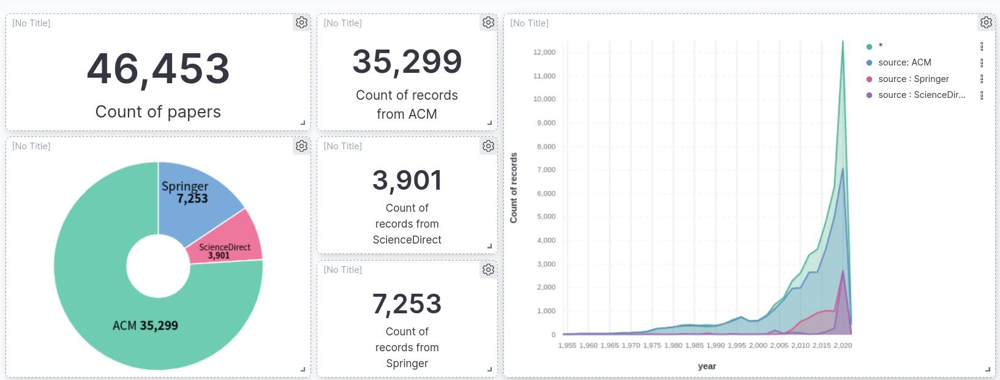
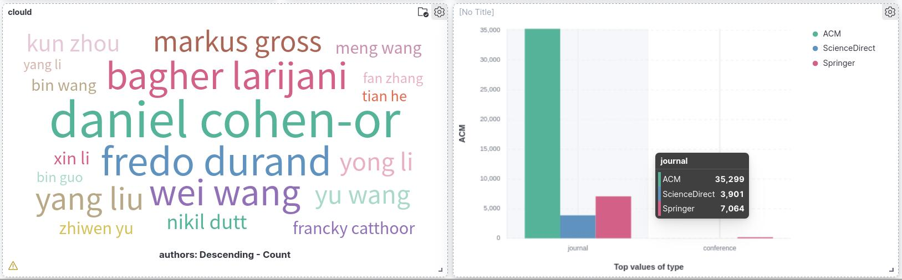
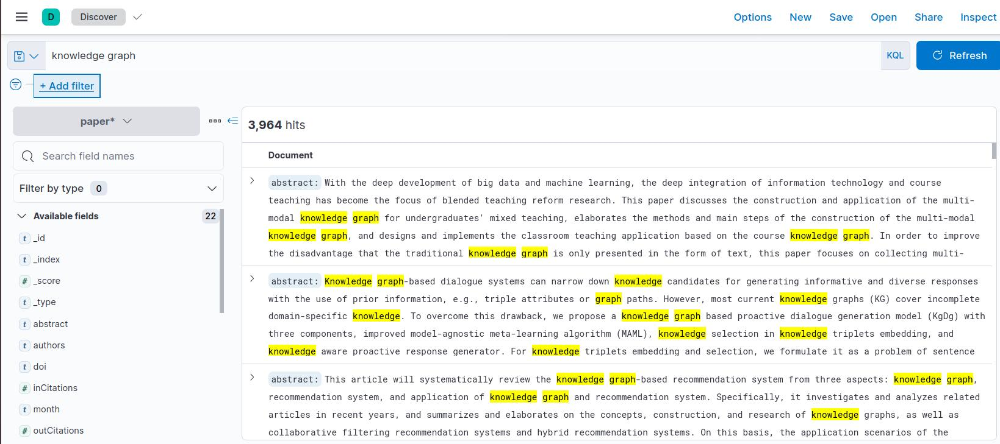

# project1-lumos
# 爬虫模块
## 一、模块要求
### 1. 课堂要求
+ **ACM必选**，要保证爬到的论文中有一定比例的**视频**，可以是在线观看视频的url地址，也可以是下载视频到本地后的文件路径
+ **Springer必选**
+ **ScienceDirect必选**，要求包含**多领域**的数据
+ 图书馆数据源为**可选加分项**
+ 爬到的数据必须存储到[MongoDB](https://www.mongodb.com)中，字段定义详见`db_fields.md`
+ 数据源越丰富越好，当从不同数据源爬取到相同论文时，需要**去除重复数据**
+ 从每个数据源获取的数据需要具有**完备性**，即爬取数据量占全站数据量的比例越高越好

+ 要求搭建一个完整的**爬虫框架**，在爬取不同的数据源时，只需要根据实际情况，手写少量解析网页的部分，即数据源是可插拔的。此处推荐[Python Scrapy爬虫库](https://scrapy.org)
+ 要求实现**增量式**爬取，定时更新
+ 要求爬虫至少采用如下技术手段：
  + 当爬取一个规模较大的网站时，采用某种策略/顺序，保证爬取结果不重不漏
  + 使用多线程/多进程等技术提升爬虫效率
  + 使用ip池、调整等待时间等技术抵御网站反爬
  + 如果网络崩溃，能够从断点续爬
  + 使用日志技术实时展示爬取进度
+ 搭建一个基本的[Elasticsearch](https://www.elastic.co/)+[Kibana](https://www.elastic.co/cn/kibana/)检索系统，对爬取的数据建立索引，方便展示

## 二、小组成员及分工
hide
## 三、爬虫内容及统计信息
|  网站   | 论文总量 |  视频数量   | pdf数量  |  IP池   | 线程池  | 增量式  |
|  ----  | ----  |  ----  | ----  |  ----  | ----  |  ----  |
| ACM  | 38195 |  1901  | 16659  |  ✔  | ✔  | ✔  |
|  Springer  | 7253 | 0 | 6474 |  ✔  | ✔  |  ✔  |
|  ScienceDirect | 2417 | 0 | 1213  | ✔ | ✔  |  ✔  |

## 四、基础爬虫模块说明
该部分分别对ACM，Springer，ScienceDirect三个网站的所有信息的爬取进行说明，包括代码目录结构、代码必要说明、部署过程、启动运行流程、依赖的第三方库及版本。  
### 1. ACM
基于request+beautifulsoup开发，高效率爬取https://dl.acm.org/ 网站上的论文，支持爬取论文的基本信息，对应pdf和视频，支持增量式爬取，使用了代理和ip池等技术

#### 1.1 依赖的第三方库
requests==2.20.0
pymongo==3.12.1
psutil==5.8.0
tqdm==4.62.3
beautifulsoup4==4.10.0

#### 1.2 代码结构
```
./ACM
├── README.md  
├── basicInfo.log  
├── url.log
└── utils  
  ├── ACMUrlsCrawler.py
  ├── ContentDownloader.py
  ├── PDFDownloader.py
  ├── VideoDownloader.py
  ├── LevelUrls.py
  └── GetProxy.py
```

#### 1.3 运行代码
```bash
cd utils
python ACMUrlsCrawler.py      # 爬取论文的url
python ContentDownloader.py   # 爬取论文的基本信息
python PDFDownloader.py       # 爬取论文的PDF
python VideoDownloader.py     # 爬取论文的video
```

#### 1.4 工作流程
1. 从网站 [ACM](https://dl.acm.org/) 获取到所有论文的url并存入数据库，采用深度搜索的方式
2. 对于第1步中获取到的论文url, 发送request的get请求获取论文的标题，作者，摘要，发布组织，年份，pdf的url，代码的url，视频url等相关信息，保存至mongodb中，并将pdf和视频的url保存至对应表中
3. 为了实现增量式爬取，我们给论文的url设置了visit字段，标记该论文的基本信息是否爬去过，同时在论文信息中设置pdf和video的visit字段，用来标记pdf和video是否已经爬取下来
4. 由于视频以及pdf网站被墙以及反爬虫的策略，我们采用了IP池和随机等待时间技术

#### 1.5 一些注意事项
1. 因为 [ACM](https://dl.acm.org/) 网站是动态网站，所以借用谷歌浏览器的驱动插件来实现模拟人滑动浏览器，等到网页全部加载出来，再爬取里面的内容，如此就不会导致爬取的内容缺失
2. journals 和 browse 两种类型的论文爬取方式不太一样：journals类型的论文总共有63个二级页面，所以以一个二级页面为分界，爬取该二级页面下的所有论文的url，然后存储到数据库中，同时把该二级页面的url存储到数据库中，如此就可以保证程序中断后重新开始爬虫时，可以跳过这个爬取过的二级页面browse 类型的论文以一个期刊的一个翻页为分界，一般一个翻页里有20篇论文，爬取这20篇论文的url并存储到数据库中，同时把该二级页面的url存储到数据库中，如此就可以保证断点续爬


### 2. Springer
基于request+beautifulsoup进行开发，高效率爬取 [Springer](https://link.springer.com/) 网站上的论文，支持爬取论文的基本信息和pdf，支持增量式爬取。

#### 2.1 依赖的第三方库
requests==2.20.0
pymongo==3.12.1
psutil==5.8.0
tqdm==4.62.3
beautifulsoup4==4.10.0

#### 2.2 代码结构
```
./Springer
├── basicInfo.log  
├── url.log
└── utils  
  ├── SpringerUrls.py
  ├── SpringerContent.py
  ├── PDFDownloader.py
  ├── config.py
  └── GetProxy.py
```

#### 2.3 运行代码
```bash
cd utils
python SpringerUrls.py      # 爬取论文的url
python SpringerContent.py   # 爬取论文的基本信息
python PDFDownloader.py       # 爬取论文的PDF
```

#### 2.4 工作流程
1. 从网站 [Springer](https://link.springer.com/) 获取到所有论文的url并存入数据库，采用深度搜索的方式
2. 对于第1步中获取到的论文url, 发送request的get请求获取论文的标题，作者，摘要，发布组织，年份，pdf的url，代码的url等相关信息，保存至mongodb中，并将pdf的url保存至对应表中
3. 为了实现增量式爬取，我们给论文的url设置了visit字段，标记该论文的基本信息是否爬去过，同时在论文信息中设置pdf的visit字段，用来标记pdf是否已经爬取下来
4. 为解决网站登录问题，我们使用了cookie

#### 2.5 一些注意事项
1. 对于 Springer 网站的登录机制，我们使用了cookie
2. journals 和 conferece 两种类型的论文由于网页html构造不同，因此使用了不同的函数分别对两种类型的论文网页进行解析。其中，SpringerUrls.py中的getConferencefromTopLevel函数用来爬取 conferece 类型的论文，getJournalfromTopLevel函数用来爬取 journal 类型的论文，在运行时可以加以区分
3. Springer 网站的部分论文需要付费购买，因此暂时无法对这部分论文进行爬取

### 3. ScienceDirect

基于request+beautifulsoup进行开发，高效率爬取 [ScienceDirect](https://www.sciencedirect.com/)  网站上的论文，支持爬取论文的基本信息和pdf，支持增量式爬取。

#### 3.1 依赖的第三方库
requests==2.20.0
pymongo==3.12.1
psutil==5.8.0
tqdm==4.62.3
beautifulsoup4==4.10.0

#### 3.2 代码结构
```
./ScienceDirect
├── basicInfo.log  
├── url.log
└── utils  
  ├── SciDirUrlsCrawler.py
  ├── ContentManager.py
  ├── PDFManager.py
  ├── LevelUrls.py
  ├── config.py
  └── GetProxy.py
```

#### 3.3 运行代码
```bash
cd utils
python SciDirUrlsCrawler.py      # 爬取论文的url
python ContentManager.py         # 爬取论文的基本信息
python PDFManager.py             # 爬取论文的PDF
```

#### 3.4 工作流程
1. 从网站 [ScienceDirect](https://www.sciencedirect.com/) 获取到所有论文的url并存入数据库，采用深度搜索的方式
2. 对于第1步中获取到的论文url, 发送request的get请求获取论文的标题，作者，摘要，发布组织，年份，pdf的url，代码的url等相关信息，保存至mongodb中，并将pdf的url保存至对应表中
3. 为了实现增量式爬取，我们给论文的url设置了visit字段，标记该论文的基本信息是否爬去过，同时在论文信息中设置pdf的visit字段，用来标记pdf是否已经爬取下来
4. 由于网站被墙以及反爬虫的策略，我们采用了IP池和随机等待时间技术

#### 3.5 一些注意事项
1. 因为 [ScienceDirect](https://www.sciencedirect.com/) 网站是动态网站，所以借用谷歌浏览器的驱动插件来实现模拟人滑动浏览器，等到网页全部加载出来，再爬取里面的内容，如此就不会导致爬取的内容缺失
2. 因为 [ScienceDirect](https://www.sciencedirect.com/) 网站的pdf网页对应的url有两种形式，请求第一种形式只能获得网页的html代码，所以同样需要借助谷歌浏览器的驱动插件来实现模拟人滑动浏览器，等到网页全部加载出来，形成pdf对应的url，在进行request请求获取pdf文件
3. 由于 [ScienceDirect](https://www.sciencedirect.com/) 网站的部分pdf北理没有权限获取，故没有爬取这一部分的pdf文件

## 五、性能提升模块说明
该部分分别对IP池、线程池和增量式的实现进行相关说明
### 1. 线程池
由于项目爬取时单线程的爬取速度慢，会耗费过多时间，所以本项目实现了线程池进行并发爬虫，具体应用到视频和pdf的下载过程中。  
#### 1.1  关于线程池的选取
使用threadpool模块进行线程池的实现。以ACM中视频的下载为例，我们声明了一个指定大小的线程池，通过一个方法downloadVideo()和一组参数args来构造请求，再将这些请求全部放进线程池里，此时，线程池会自动等待这些请求执行完毕。

#### 1.2 依赖
```python
import threadpool
```
#### 1.3 相关函数使用
```python
def run(self, poolSize=2):
    count = len(self.VideoUrl)
    # print(count)
    # 构造线程参数
    args = []
    for index in range(0, count):
      args.append((None, {'url': self.VideoUrl[index]}))
      # 线程池大小
      if count < poolSize:
          poolSize = count
      # 构造线程池
      pool = threadpool.ThreadPool(poolSize)
      requests = threadpool.makeRequests(self.downloadVideo, args)
      [pool.putRequest(req) for req in requests]
      pool.wait()
```

#### 1.4 工作模式
- ACM：线程池爬取视频。
- Springer：线程池爬取pdf。
- ScienceDirect：线程池爬取pdf。

### 2. IP Pool
由于项目爬取的网站中有视频以及PDF的下载需求，并且由于目标网站的特殊性，项目需要同时具有**防止反爬虫**的能力。因此，本项目从提供ip代理的五个网站爬取可用的ip来实现IP池，让爬虫更加高效可用。

#### 2.1 相关代码

本部分的实现在各项目中的`GetProxy.py`文件中。其中用于返回ip的函数为：

```python
def getProxy(key)
```

#### 2.2 工作模式

1. 在需要使用ip池的py程序中import这个py程序，调用getProxy函数，传递的参数为一个1-5的随机数

2. 获得函数返回的一个ip代理

3. 在request.get()中添加参数proxies=返回的ip即可实现ip代理

### 3. 增量式爬取

由于目标网站经常新增页面，本项目采取增量式爬虫，定期从网站上爬取新的论文信息。

#### 3.1 工作模式

1. 增量式改进分为两部分，一是定期爬取，选择apscheduler库的定时任务实现。

```python
sched = BlockingScheduler()
sched.add_job(run_spider, 'cron', hour=10, minute=0)
sched.start()
```

2. 另一部分是去重，本项目的具体方法是将论文的url、pdf的url和视频的url保存在在mongo数据库中，并为每条url数据设置visit字段。在爬取论文时检查url是否已经爬取，并在下载时根据visit字段判断内容是否已经下载。
去重代码主要实现于以下函数中：
.  
```
SpiderForACL/utils/ACLUrlCrawler/saveUrls,
SpiderForACL/utils/ACLUrlCrawler/getUnvisitedUrls, 
SpiderForPwC/utils/UrlCrawler/saveUrls,
SpiderForPwC/utils/PDFDownloader/addUrl,
scrapy/crossminds_saver/save_paperinfo
```

#### 3.2 运行方法

直接运行根目录下ACL_Inc.py，PwC_Inc.py，CrossMind_Inc.py，即可每天按时爬取新论文。
```
python ACL_Inc.py
python CrossMind_Inc.py
python PwC_Inc.py
```

#### 3.3 依赖

```
apscheduler==3.6.3
datetime
```
## 六、检索模块

### 1 搭建
#### 1.1 环境依赖
```
ElasticSearch-7.15.2
Kibana-7.15.2
Python libraries:
    elasticsearch
    pymongo
```
在服务器端安装好指定版本的ElasticSearch以及Kibana，并通过修改配置文件完成Kibana与ElasticSearch的连接。
默认情况下，ElasticSearch的链接端口为localhost:9200，Kibana的端口是localhost:5601。
#### 1.2 代码结构
```
./search
├── config_retrieval 
├── index_template.json
└── insert.py  
```

#### 1.3 数据库连接
通过pymongo连接MongoDB，读取数据库中存储好的论文信息，其中主要读取的是ACMBasicInfo、SpringerBasicInfo和SciDirBasicInfo三个表。
为实现MongoDB到ElasticSearch的数据迁移，需要连接MongoDB数据库。通过修改配置文件config_retrieval，实现对数据库的灵活控制，其中可能的需要修改的数据包括：
```
db = paper //数据库名称
host = 10.108.18.24 //数据库所在服务器地址
port = 27017 //访问数据库端口
```
### 2 创建索引及数据迁移
#### 2.1索引创建
ElasticSearch内部采用索引(Index)的结构存储数据，
可以通过修改index_template.json达到修改索引结构从而实现对ElasticSearch中数据的检索功能修改的目的。
对于字符串型的数据，分成text和keyword两种类型，其中keyword用于可视化情景筛选聚合，text用于全文检索。
其中默认索引设置如下：
```
{
        "settings": {
            "analysis": {
                "normalizer": {
                    "my_normalizer": {
                        "type": "custom",
                        "filter": ["lowercase", "asciifolding"]
                    }
                }
            }
        },
        "mappings": {
            "properties": {
                "title": {
                    "type": "text",
                    "index": "true",
                    "normalizer": "my_normalizer"
                },
                "abstract": {
                    "type": "text",
                    "index": "true"

                },
                "authors": {
                    "type": "keyword",
                    "index": "true",
                    "normalizer": "my_normalizer"
                },
                "doi": {
                    "type": "text",
                    "index": "false"
                },
                "url": {
                    "type": "text",
                    "index": "false"
                },
                "year": {
                    "type": "integer"
                },
                "month": {
                    "type": "text"
                },
                "type": {
                    "type": "keyword"
                },
                "venue": {
                    "type": "keyword"
                },
                "source": {
                    "type": "keyword"
                },
                "video_url": {
                    "type": "text"
                },
                "video_path": {
                    "type": "text"
                },
                "thumbnail_url": {
                    "type": "text"
                },
                "pdf_url": {
                    "type": "text"
                },
                "pdf_path": {
                    "type": "text"
                },
                "inCitations": {
                    "type": "long"
                },
                "outCitations": {
                    "type": "long"
                }
            }
        }
    }
```
#### 2.2运行方法
执行如下指令即可完成ElasticSearch索引创建以及数据迁移。
```
python insert.py
```
### 3 可视化
运行Kibana并访问localhost:5601即可进行检索和数据可视化分析。

+ 可视化界面展示来自不同站点的论文数目，不同年份的论文示例


+ 可视化界面展示作者云图以及期刊和会议论文比例示例


+ 执行检索结果示例




